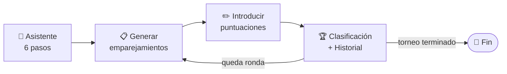
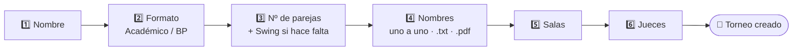
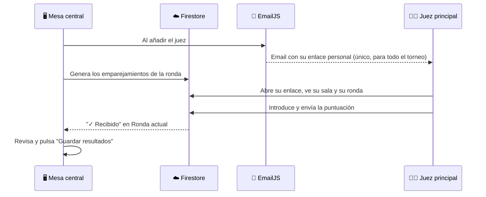

<div align="center">


<br/><br/>


</div>

## 🐾 Qué es

CeceCat es un gestor de torneos de debate por parejas: crea el torneo con un asistente guiado, genera los emparejamientos de cada ronda, reparte los jueces entre las salas, recoge las puntuaciones (a mano o en vivo desde el móvil de cada juez) y lleva la clasificación — todo desde una única página web.

No hay servidor propio, no hay base de datos que mantener, no hay instalación. `index.html` es **un solo archivo**: todo el algoritmo de emparejamientos, la asignación de jueces, el cálculo de puntos y la clasificación corren enteros en el navegador de quien lo abra, y sigue funcionando sin conexión salvo por dos piezas opcionales — el envío de puntuaciones en vivo y el email a los jueces — que si no se configuran, simplemente no se activan y todo lo demás sigue igual.

<div align="center">

### 🧭 Tabla de contenidos

[Cómo se organiza un torneo](#-cómo-se-organiza-un-torneo) · [El asistente guiado](#-el-asistente-guiado) · [Draw, ronda y clasificación](#-draw-ronda-actual-y-clasificación) · [Jueces que rotan de verdad](#-jueces-reparto-automático-que-rota-de-verdad) · [Puntuaciones en vivo](#-puntuaciones-en-vivo-desde-el-móvil-de-cada-juez) · [Copias de seguridad](#-copias-de-seguridad-tres-capas) · [Configurar Firestore + EmailJS](#-configurar-el-envío-de-puntuaciones) · [Durante el torneo](#-durante-el-torneo)

</div>


## 🗂 Cómo se organiza un torneo



Cada ronda repite el mismo ciclo: generar el draw, puntuar, ver la clasificación actualizada y pasar a la siguiente. El estado completo del torneo — parejas, jueces, rondas jugadas, puntos — vive en un único objeto en memoria que se guarda solo, así que se puede cerrar la pestaña a media ronda y seguir donde se dejó.

## 🧙 El asistente guiado


Crear un torneo son 6 pasos, con botón "Atrás" en cada uno sin perder lo ya rellenado:



<details>
<summary><b>1️⃣ Nombre del torneo</b></summary>
<br/>

Es el único paso obligatorio de verdad: el botón "Siguiente" no avanza (y avisa) si se deja en blanco.
</details>

<details>
<summary><b>2️⃣ Formato — Académico o British Parliamentary</b></summary>
<br/>

- **Académico:** 1 pareja a favor contra 1 en contra. Tú decides los apartados de puntuación del torneo (por ejemplo "Contenido", "Estilo", "Estrategia" vienen de ejemplo, pero se pueden borrar y poner los tuyos — hace falta al menos uno). Se pueden añadir o quitar apartados más tarde, a mitad de torneo, desde la pestaña "Datos"; el cambio solo afecta a las rondas que aún no se hayan guardado.
- **British Parliamentary:** 4 parejas por sala (OG, OO, CG, CO), puntuando cada orador de la pareja entre 50 y 100 — el propio formulario no deja meter nada fuera de rango. El total de la pareja marca el orden 1º–4º de la sala.

En ambos formatos, no se permiten empates en el total: si dos parejas empatan, hay que corregir la puntuación antes de poder guardar.
</details>

<details>
<summary><b>3️⃣ Número de parejas — y las Swing en BP</b></summary>
<br/>

Si el formato es BP y el número no es múltiplo de 4, la propia pantalla avisa de cuántas parejas **Swing** (Swing 1, Swing 2…) se añaden automáticamente para completar las salas. Así nunca hay descansos por descuadre en BP: en su lugar juegan parejas de relleno que no compiten por la clasificación final. Las Swing se calculan una sola vez al crear el torneo y se mantienen fijas toda la competición.
</details>

<details>
<summary><b>4️⃣ Nombres de las parejas</b></summary>
<br/>

Tres formas de darlas de alta, a elegir:
- Solo el número (se llaman "Pareja 1", "Pareja 2"…).
- Una a una, con un contador que avisa cuándo ya se ha llegado al número indicado en el paso 3.
- Importando un `.txt` o `.pdf` con un nombre por línea — con vista previa editable antes de confirmar, por si el PDF tiene un formato complicado (columnas, tablas) y no sale perfecto a la primera.

La lectura de PDF funciona **sin conexión a internet**: la librería va incrustada en el propio `index.html`.
</details>

<details>
<summary><b>5️⃣ Salas</b></summary>
<br/>

Opcional. Se le puede poner nombre real a cada sala (p. ej. "Aula 1 - A1"); las que falten — o todas, si no se añade ninguna — se numeran solas como "Sala 1", "Sala 2"…
</details>

<details>
<summary><b>6️⃣ Jueces</b></summary>
<br/>

Opcional. Se añaden uno a uno, marcando si son **en prácticas** ("trainee") y con su email. En cuanto se añade un juez con el envío remoto activado (ver más abajo), le llega automáticamente por correo su enlace personal — el mismo durante todo el torneo, así no hace falta generarle uno nuevo ronda a ronda.
</details>


## 📋 Draw, ronda actual y clasificación

- **Pestaña Draw**, pensada para proyectar en pantalla: una tabla grande con la sala, las parejas en columnas según su posición y, si hay jueces, la columna de jueces de cada sala. Tiene botón de pantalla completa, y si aún no se han generado los emparejamientos de la ronda, deja generarlos ahí mismo.
- **Ronda actual** empareja/agrupa por clasificación (puntos de equipo → puntos de ítem), evita repetir rivales cuando es posible, y reparte los roles/posiciones equilibrando quién los ha ocupado menos veces. Ahí se introducen los puntos de cada enfrentamiento, con la suma en vivo mientras se rellena.
- **Clasificación** e **Historial** llevan la cuenta completa: columnas según el formato, desglose de cada enfrentamiento con sala y jueces, y un resumen del torneo. Las parejas Swing van marcadas con una etiqueta y no cuentan para el "líder actual".
- **Parejas**, **Salas** y **Jueces** permiten corregir nombres, o añadir/quitar salas y jueces, en cualquier momento sin perder resultados ya guardados.

## ⚖️ Jueces: reparto automático que rota de verdad


Al generar cada ronda, los jueces se reparten solos entre las salas — y no de cualquier manera:

- 🚫 **Un juez en prácticas nunca es el principal de una sala.** El principal (el que aparece marcado con Ⓒ, el único que puede enviar la puntuación desde su enlace) siempre es un juez no-trainee si hay alguno disponible en esa ronda.
- 🔁 **Todos los jueces juzgan en todas las rondas**, repartidos lo más equilibrado posible según cuántas veces ha sido asignado cada uno.
- 🔄 **El reparto evita, cuando es posible, dos repeticiones:** que un juez vuelva a coincidir en sala con otro juez con el que ya ha estado, y que vuelva a juzgar a una pareja a la que ya juzgó antes. En cada ronda, el algoritmo compara todas las combinaciones posibles de (sala, juez) y elige la que menos repite — no decide sala por sala en un orden fijo, así que quién acaba compartiendo mesa con quién cambia de verdad ronda a ronda.
- 🩹 **Se autorrepara sola:** si se importa una copia de seguridad antigua, o se recarga la página, CeceCat reconstruye desde cero (a partir de las rondas ya jugadas) el historial de qué ha juzgado cada juez y con quién ha coincidido, así que el reparto tiene siempre memoria completa aunque el navegador se haya cerrado a medio torneo.

> Con muy pocas parejas y jueces, el margen para variar es limitado por pura combinatoria (si solo hay 3 jueces y 2 salas, tarde o temprano alguien repite). Cuantas más parejas y jueces tenga el torneo, más fácil es rotar sin repetir a nadie.

## ⚡ Puntuaciones en vivo desde el móvil de cada juez


**(Opcional).** Si se activan Firebase y EmailJS (ver [más abajo](#-configurar-el-envío-de-puntuaciones)), cada juez tiene **un único enlace para todo el torneo** — se genera al añadirlo y se le envía automáticamente por correo, sin generar ni reenviar nada ronda a ronda.



Ese enlace abre una vista solo para ese juez, sin navegación ni datos del resto del torneo, con dos pestañas:

- **"Mi turno actual"** — la sala y ronda que le toca ahora mismo, o un aviso si esa ronda no le toca juzgar.
- **"Draw"** — la misma tabla que se proyecta en pantalla.

Dentro de cada sala solo el juez principal ve el formulario de puntuación y puede enviarla; el resto de jueces de esa sala ven un aviso pidiéndoles que le compartan su valoración a él. Si una sala se queda sin juez principal (por ejemplo, si solo tiene jueces en prácticas), se avisa de que nadie puede enviar desde ahí y hay que introducir los puntos a mano.

Central sigue teniendo la última palabra siempre: en cuanto llega una puntuación aparece "✓ Recibido" y los números se rellenan solos, pero hay que revisar y pulsar "Guardar resultados" igual que si se hubiera metido a mano. Si un juez no tiene el enlace, no tiene email, o falla la conexión, se meten los puntos a mano como siempre — nada de esto es obligatorio.

## 💾 Copias de seguridad, tres capas


<table width="100%">
<tr>
<td width="33%" valign="top">

### 1️⃣ Automática en el navegador

Cada cambio se guarda solo en `localStorage`. Si se recarga la página, no se pierde nada — siempre que sea el mismo navegador y ordenador.

</td>
<td width="33%" valign="top">

### 2️⃣ Manual, descargable

Botones para descargar en cualquier momento una copia exacta (`.json`, para recuperar el torneo tal cual) y un informe legible (`.txt`, con sala, jueces y desglose de cada enfrentamiento). El `.json` se puede volver a cargar para continuar desde otro ordenador.

</td>
<td width="33%" valign="top">

### 3️⃣ Automática en disco, por ronda

Al crear el torneo, se puede elegir una carpeta del ordenador (se abre directamente dentro de Descargas). A partir de ahí, cada cambio guarda solo — sin tener que hacer nada más — un snapshot en `<carpeta>/<torneo>/r1`, `r2`, `r3`… con el `.json` y el `.txt` de esa ronda. Así, si el navegador o el ordenador fallasen, los resultados ya están en disco.

</td>
</tr>
</table>

> La copia en disco usa la *File System Access API*, así que solo funciona en navegadores basados en Chromium (Chrome, Edge). En el resto, esa opción simplemente no aparece y las otras dos capas siguen funcionando igual.

<div align="center">

</div>


## 🔥 Configurar el envío de puntuaciones


Hace falta un proyecto de **Firebase** (Firestore, plan gratuito Spark) y una cuenta de **EmailJS** (plan gratuito, 200 emails/mes). Si ya están configurados dentro de `index.html`, este paso está hecho — en cuanto esté publicado en algún sitio accesible, cada juez que se añada recibe su enlace automáticamente.

<details>
<summary><b>☁️ Firestore — reglas</b></summary>
<br/>

En Firebase → Firestore Database (modo producción) → Reglas, hay que publicar estas:

```
rules_version = '2';
service cloud.firestore {
  match /databases/{database}/documents {
    match /cececat_draws/{tournamentToken} {
      allow read: if true;
      allow write: if true;
    }
    match /cececat_judgerooms/{judgeToken} {
      allow read: if true;
      allow create: if true;
      allow update: if resource.data.status == 'pending'
        || request.resource.data.roundNumber != resource.data.roundNumber;
    }
  }
}
```

Hay dos colecciones: `cececat_draws` guarda el Draw completo de cada torneo (para que la pestaña "Draw" de cada juez lo pueda leer sin ver el resto de datos del torneo), y `cececat_judgerooms` guarda, por cada juez (`judgeToken`, el código largo y aleatorio de su enlace personal), la sala/ronda que le toca ahora y su puntuación cuando la envía. Solo el documento de un juez puede quedar bloqueado tras enviarse (mientras su ronda actual no cambie); en cuanto le toca una ronda nueva, su documento vuelve a aceptar un envío.

**Nota de seguridad:** estas reglas son deliberadamente simples y abiertas — no hay usuarios ni contraseñas, la única "llave" es el propio enlace de cada juez (difícil de adivinar). Es un nivel razonable para un torneo interno, pero no subas nada más sensible a esta base de datos.
</details>

<details>
<summary><b>📧 EmailJS — plantilla y conexión</b></summary>
<br/>

El envío automático del enlace usa una cuenta de EmailJS conectada a un Gmail como servicio de envío, con una plantilla que usa las variables `to_email`, `to_name`, `tournament_name` y `judge_link`. Los tres valores de conexión van en `index.html` (busca `const EMAILJS_CONFIG = {` cerca del principio del `<script>`): la Public Key, el Service ID y el Template ID.

Antes del torneo conviene probarlo: crea un torneo de prueba con un juez con tu propio email, comprueba que llega el correo con el enlace, ábrelo en el móvil (o en modo incógnito) y comprueba que el envío de puntuación llega a central en segundos.

Para desactivar solo el envío automático de emails (Firestore seguiría funcionando, copiando el enlace a mano con el botón "Copiar enlace del juez principal"), basta con volver a poner `publicKey: "TU_PUBLIC_KEY"` en `EMAILJS_CONFIG`. Para desactivar todo el envío remoto de puntuaciones, vuelve a poner `apiKey: "TU_API_KEY"` en `const FIREBASE_CONFIG = {` — el resto de CeceCat sigue funcionando igual, todo a mano.
</details>

<details>
<summary><b>🔧 Usar tus propios proyectos en vez de los ya configurados</b></summary>
<br/>

En Firebase, crea un proyecto en [console.firebase.google.com](https://console.firebase.google.com), activa Firestore Database (modo producción), añade una app web desde Configuración del proyecto → General → "Tus apps" (icono `</>`), y copia su `firebaseConfig` sobre los 6 valores de `FIREBASE_CONFIG` en `index.html`. Pega las reglas de arriba en su Firestore → Reglas.

En EmailJS, crea una cuenta gratuita en [emailjs.com](https://www.emailjs.com), conecta un servicio de email (Gmail u otro), crea una plantilla con las cuatro variables `to_email`, `to_name`, `tournament_name` y `judge_link` (usa `{{to_email}}` como "To Email" de la plantilla), y copia tu Public Key (Account → General) y los IDs de servicio/plantilla sobre `EMAILJS_CONFIG` en `index.html`.
</details>


## 🧭 Durante el torneo

- Los datos se guardan **en el navegador que se esté usando**. Si quien lleva la mesa central va a manejar el torneo, mejor que lo haga siempre desde el mismo ordenador/navegador, o que descargue la copia de seguridad al terminar cada ronda para poder continuar desde otro sitio si hace falta — o, mejor aún, que active la copia automática en disco al crear el torneo.
- Los nombres de las parejas se pueden editar en cualquier momento desde la pestaña "Parejas", sin perder resultados ya guardados.
- Para empezar un torneo nuevo desde cero hay un botón en "Datos → Zona de peligro" (borra el actual, así que conviene exportar antes si se quiere conservar).
- Cada juez tiene un enlace único y persistente para todo el torneo (se envía, o se reenvía, una sola vez) — al generar los emparejamientos de cada ronda nueva, su enlace muestra solo la sala y el turno que le toque en cada momento, sin generar ni reenviar nada.

<div align="center">

<br/>


**Hecho con 🐾 y JavaScript.**

</div>
